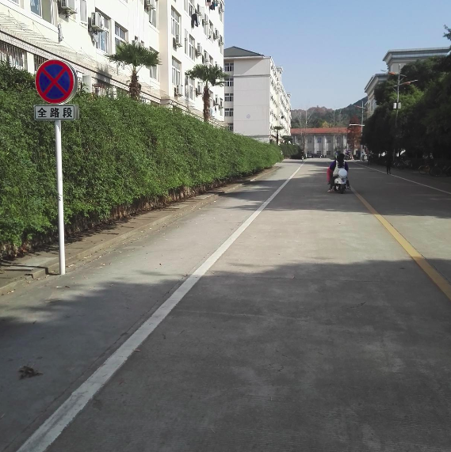
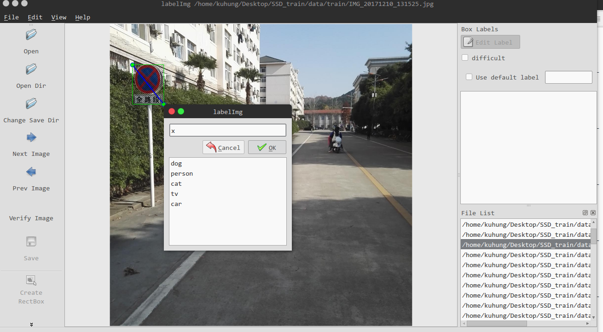
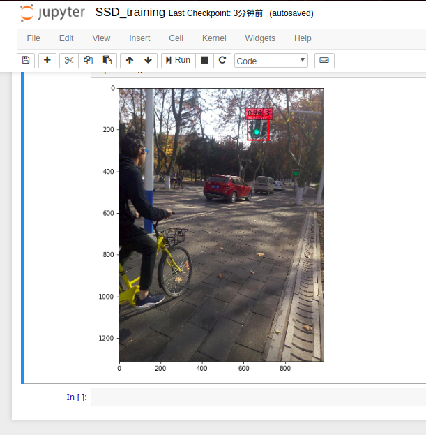

# SSD_train 以交通标志识别为例

``` bash
关键词: 交通标志识别 神经网路 目标检测 SSD Keras
```

我们的目的是训练一个神经网络模型,让他能够对交通标志进行识别.这里,我们采用的是 keras 版的 SSD 模型.

为了模型更好的训练,我们简化了训练样本,对下列三种标志进行识别.训练样本总计138张,每类约46张.

- 局部图示例
<p align="center">


</p>

- 完整大图示例
<p align="center">

</p>

## Step 1. 数据准备

### 数据标记

- 使用[labelImg](https://github.com/tzutalin/labelImg)对数据进行标记.
<p align="center">

</p>

每张图标记,分别得到一个如下的 XML 数据结构:

```
<annotation>
	<folder>train</folder>
	<filename>IMG_20171210_131006.jpg</filename>
	<path>/home/kuhung/Desktop/SSD_train/data/train/IMG_20171210_131006.jpg</path>
	<source>
		<database>Unknown</database>
	</source>
	<size>
		<width>1216</width>
		<height>1216</height>
		<depth>3</depth>
	</size>
	<segmented>0</segmented>
	<object>
		<name>x</name>
		<pose>Unspecified</pose>
		<truncated>0</truncated>
		<difficult>0</difficult>
		<bndbox>
			<xmin>623</xmin>
			<ymin>475</ymin>
			<xmax>682</xmax>
			<ymax>532</ymax>
		</bndbox>
	</object>
</annotation>
```

**关键信息是 文件名,种类名以及4个坐标点**,具体的文件路径不重要,后面会单独定义.

### 格式生成
```
# 目标格式
文件名,目标的4个坐标点,目标类型的哑变量编码
```
- 使用 [get_data_from_XML.py](ssd_keras/data_convert/get_data_from_XML.py)脚本,将 labelImg 得到的 XML 转成目标格式.

- 注意以下几点:

1. 修改类别数和类别名称
```Python
classes = 3
classes_name = ['x','p','t']
```
2. 运行脚本生成`train.pkl`
```Python
Python get_data_from_XML.py path_to_your_label

# 在我的本地是
Python get_data_from_XML.py /home/kuhung/Desktop/SSD_train/data/label_train/
```

--- 

## Step 2. 开始训练

### 依赖
```
cv2==3.3.0
keras==2.2.0
matplotlib==2.1.0
tensorflow==1.3.0
numpy==1.13.3
```

### 预训练权重
- 下载 [weights_SSD300.hdf5](https://github.com/kuhung/SSD_keras/releases/tag/model_weight)

```bash
cp weights_SSD300.hdf5 into SSD_keras
```

### 核心脚本
- 进入 [ssd_keras/SSD_training.ipynb](ssd_keras/SSD_training.ipynb)

1. 修改类别数和类别名称
```Python
# some constants
NUM_CLASSES = 3+1  # 1 means mask
input_shape = (300, 300, 3)
```

2. 修改图片存储位置
```Python
path_prefix = '../data/train/'   #path to your data 

```
3. 训练模型
在完成上述修改后,通过逐步运行  `SSD_training.ipynb`, 自定义的SSD模型就开始训练了.

---

## 效果

###  5次迭代示意图

```
Epoch 1/5
108/110 [============================>.] - ETA: 2s - loss: 3.9356Epoch 00000: saving model to ./checkpoints/weights.00-3.50.hdf5
110/110 [==============================] - 127s - loss: 3.9005 - val_loss: 3.4982
...
Epoch 5/5
108/110 [============================>.] - ETA: 1s - loss: 1.8918Epoch 00004: saving model to ./checkpoints/weights.04-2.13.hdf5
110/110 [==============================] - 116s - loss: 1.8814 - val_loss: 2.1328
```

### 测试集的效果

<p align="center">

</p>

0.96的置信度,判断为第三类(红绿灯类).

## 小结
通过这个例子,我们掌握了如何用 keras 版的  SSD, 训练自己的数据集. 在小数据集上也取得了不错的结果.整个流程需要注意的有两个点:一是检查各依赖的版本,是否符合要求;二是自定义任务,要改的地方比较多比较杂,需要耐心和细心.

你有遇到什么问题吗?欢迎在 issue 提出.


