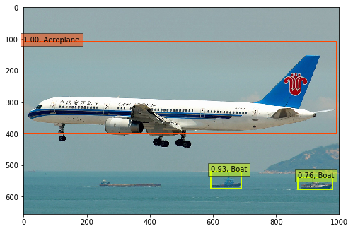
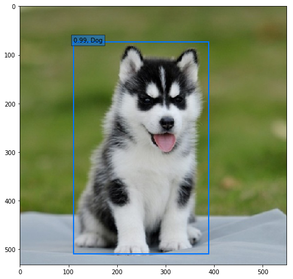
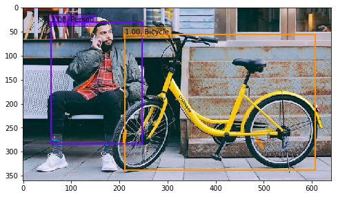
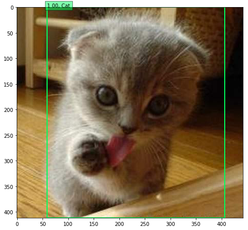

##Single Shot MultiBox Detector to Keras version.

模型对载具及动物的检测
<p align="center">






</p>

模型的视频检测效果


## 依赖
```
cv2==3.3.0
keras==1.2.2
matplotlib==2.1.0
tensorflow==1.3.0
numpy==1.13.3
```
如果想跑通视频模块，则需额外`pip install scikit-video`

## 使用说明

- Download model weight `weights_SSD300.hdf5`[here](https://github.com/kuhung/SSD_keras/releases)


## 参考资料
[arXiv paper](http://arxiv.org/abs/1512.02325)
[rykov8/ssd_keras](https://github.com/rykov8/ssd_keras)
